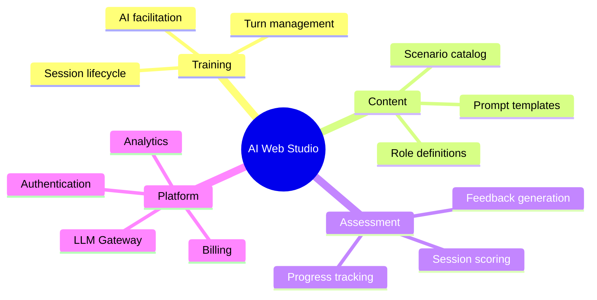

# Capability Map

## Platform capabilities



## Capability → Domain mapping

| Capability | Domain | Status |
|---|---|---|
| Session lifecycle | training-session | active |
| Turn management | training-session | active |
| AI facilitation | training-session | active |
| Scenario catalog | scenario-catalog | planned |
| Session scoring | assessment | planned |
| Feedback generation | assessment | planned |
| Progress tracking | learner-progress | planned |
| Authentication | auth (infrastructure) | planned |
| LLM Gateway | llm-gateway (infrastructure) | planned |

## Domains by status

```dataview
TABLE status, owner
FROM "domains"
WHERE type = "domain"
GROUP BY status
```
