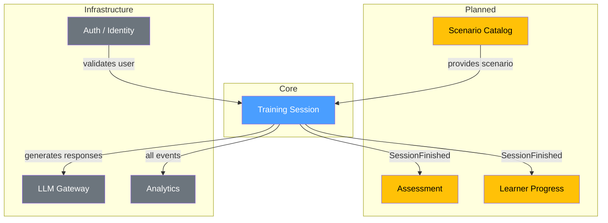

# Domain Map

## Overview



> [!info] Legend
> - Синий: Active (домен задокументирован)
> - Жёлтый: Planned (упоминается в интеграциях, но не создан)
> - Серый: Infrastructure (внешние сервисы)

## Active domains

```dataview
TABLE owner, status, length(file.inlinks) AS "refs"
FROM "domains"
WHERE type = "domain"
SORT domain
```

## Domain relationships

```dataview
TABLE domain, file.folder AS "path"
FROM "domains"
WHERE type = "integrations"
SORT domain
```
