# Onboarding guide

## System overview

**Documentation-first development** --- подход, при котором любое изменение в системе начинается с документа, а не с кода. Документация --- это не артефакт после разработки, а конвейер, через который проходит каждая фича. Нет документа --- нет задачи, физически.

**Domain-Driven Design (DDD) для документации** означает, что бизнес-логика описывается на языке предметной области, а не на языке реализации. Каждый домен имеет свой ubiquitous language, агрегаты, события и инварианты. Это позволяет разработчикам и бизнесу говорить на одном языке.

**Change packages (CHG-XXXX)** --- иммутабельные наборы документов, описывающие одно конкретное изменение от идеи до раскатки. Каждый change package проходит через конвейер из 8 стадий, на каждой из которых работает свой AI-агент. После мержа change package никогда не удаляется и не редактируется.

> [!danger] Ключевой принцип
> **Нет документа --- нет задачи.** PR без ссылки на CHG-* не мержится.

## Process pipeline

```mermaid
flowchart LR
    S00["00 Intake\n/pm"] --> S01["01 Discovery\n/analyst"]
    S01 --> S02["02 Product Spec\n/analyst"]
    S02 --> S03["03 Domain Impact\n/analyst"]
    S03 --> S04["04 System Analysis\n/analyst"]
    S04 --> S05["05 Backend Proposal\n/backend"]
    S05 --> S06["06 Frontend Proposal\n/frontend"]
    S06 --> S07["07 QA + Rollout\n/qa"]
    S07 --> S08["08 Ship"]

    style S00 fill:#e8f5e9,stroke:#2e7d32
    style S01 fill:#e3f2fd,stroke:#1565c0
    style S02 fill:#e3f2fd,stroke:#1565c0
    style S03 fill:#e3f2fd,stroke:#1565c0
    style S04 fill:#e3f2fd,stroke:#1565c0
    style S05 fill:#fff3e0,stroke:#e65100
    style S06 fill:#fce4ec,stroke:#c62828
    style S07 fill:#f3e5f5,stroke:#6a1b9a
    style S08 fill:#e0f2f1,stroke:#00695c
```



> [!info] Каждая стадия --- это документ
> На каждой стадии AI-агент создаёт или обновляет конкретный файл внутри change package. Переход к следующей стадии возможен только после завершения предыдущей.

## Repository structure

```
docs/
├── domains/      → Бизнес-домены (DDD): что делает бизнес
├── changes/      → Change packages: как система меняется
├── adrs/         → Architecture Decision Records: почему так решили
├── contexts/     → Платформенное знание: как устроена платформа
└── _meta/        → Схема документации, карты, глоссарий
.claude/
├── skills/       → AI-роли (PM, Analyst, Backend, Frontend, QA)
├── rules/        → Правила для AI-агентов
└── hooks/        → Валидация при изменении документов
```

> [!info] Разделение знаний
> - **domains/** содержат ТОЛЬКО бизнес-знание --- никакого UI, никаких имён сервисов
> - **contexts/** содержат платформенное знание --- стек, архитектуру, инструменты
> - **changes/** содержат историю изменений --- иммутабельны после мержа

## Reading path by role

### PM / Product Owner

1. [[_meta/doc-schema]] --- пойми pipeline и что создаёт каждая роль
2. [[_meta/capability-map]] --- пойми текущие возможности продукта
3. [[changes/_template/change-draft]] --- посмотри шаблон черновика
4. Твой инструмент: `/pm [описание фичи]`

### Backend Developer

1. [[_meta/doc-schema]] --- пойми pipeline
2. [[contexts/backend/architecture]] --- пойми текущий стек и паттерны
3. [[domains/training-session/README]] --- пример домена
4. [[changes/_template/05-backend-proposal]] --- шаблон backend proposal
5. Твой инструмент: `/backend CHG-XXXX`

### Frontend Developer

1. [[_meta/doc-schema]] --- пойми pipeline
2. [[contexts/frontend/architecture]] --- пойми текущий стек
3. [[changes/_template/06-frontend-proposal]] --- шаблон frontend proposal
4. Твой инструмент: `/frontend CHG-XXXX`

### QA Engineer

1. [[_meta/doc-schema]] --- пойми pipeline
2. [[contexts/qa/test-strategy]] --- пойми текущую стратегию тестирования
3. [[changes/_template/07-test-plan]] --- шаблон тест-плана
4. Твой инструмент: `/qa CHG-XXXX`

## Your first change package

Пошаговое руководство по созданию первого change package:

1. **Запусти** `/pm добавить [описание фичи]` --- ответь на вопросы PM-агента
2. **Получи CHG-XXXX** --- агент создаст папку и черновик
3. **Запусти** `/analyst CHG-XXXX` --- ответь на вопросы аналитика
4. **Запусти** `/backend CHG-XXXX` --- техническая проработка серверной части
5. **Запусти** `/frontend CHG-XXXX` --- UI-проработка
6. **Запусти** `/qa CHG-XXXX` --- план тестирования и раскатки
7. **Запусти** `/review CHG-XXXX` --- проверка целостности всего пакета
8. **Создай PR** с ссылкой на CHG-XXXX в описании

> [!tip] Быстрый запуск
> Можно запустить весь pipeline одной командой: `/new-feature [описание]`

## Key rules

> [!danger] Rule 1: Domain docs --- только бизнес-знание
> Domain docs содержат ТОЛЬКО бизнес-знание --- никакого UI, никаких имён сервисов. После мержа в domain docs уходят только: business rules, aggregates, events, invariants.

> [!danger] Rule 2: Change packages иммутабельны
> Change packages иммутабельны после мержа --- никогда не удаляются и не редактируются. Frontend proposal и backend proposal остаются в change package навсегда.

> [!danger] Rule 3: Вопросы фиксируются письменно
> Вопросы фиксируются в `10-open-questions.md`, не решаются устно. Если вопрос возник на созвоне --- запиши его в файл.

> [!danger] Rule 4: PR привязан к CHG
> PR без ссылки на CHG-* не мержится. Нет документа --- нет задачи.

## Useful links

- [[_meta/glossary]] --- глоссарий терминов
- [[_meta/domain-map]] --- карта доменов
- [[_meta/capability-map]] --- карта возможностей
- [[domains/domains-dashboard]] --- дашборд доменов
- [[changes/changes-dashboard]] --- дашборд изменений
