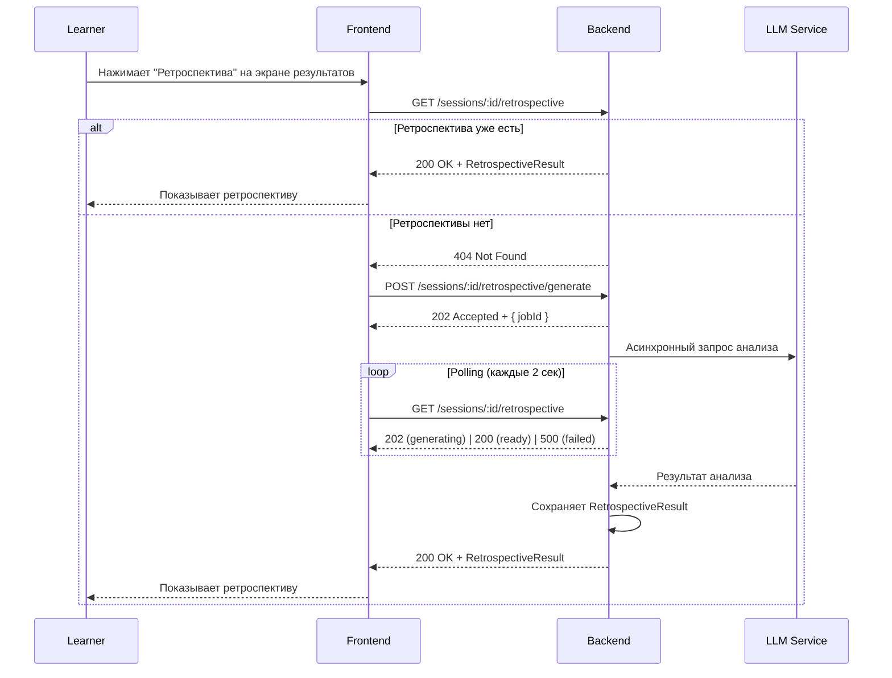
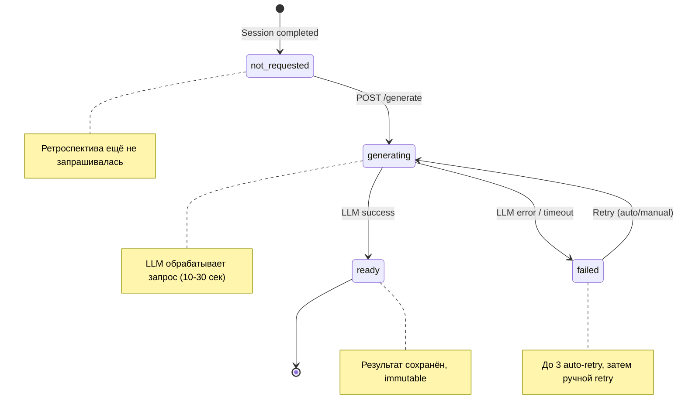

# Product spec · CHG-0000

## Goal

Дать ученику инструмент рефлексии после тренировки: подробный анализ каждого хода и персональные рекомендации от AI. Превратить одноразовую тренировку в осмысленный цикл обучения.

## Actors

- **Learner** — просматривает ретроспективу своих завершённых сессий
- **Facilitator (AI)** — анализирует ходы и формулирует рекомендации
- **System** — управляет генерацией, кешированием и cleanup

## User stories / JTBD

### US-1: Просмотр анализа ходов
> Как **Learner**, завершивший тренировку, я хочу **увидеть анализ каждого своего хода**, чтобы **понять, что я сделал хорошо, а что можно улучшить**.

### US-2: Получение рекомендаций
> Как **Learner**, я хочу **получить персональные рекомендации от AI**, чтобы **знать, на чём сфокусироваться в следующей тренировке**.

### US-3: Навигация по ходам
> Как **Learner**, просматривающий ретроспективу, я хочу **переключаться между ходами**, чтобы **детально изучить анализ конкретного момента**.

### US-4: Ретроспектива для старых сессий
> Как **Learner**, я хочу **сгенерировать ретроспективу для ранее завершённой сессии**, чтобы **вернуться к прошлым тренировкам и пересмотреть свои результаты**.

## Flows

### View Retrospective (основной flow)

### Generate Retrospective (async)

1. Backend получает POST `/sessions/:id/retrospective/generate`
2. Проверяет: сессия существует, принадлежит текущему пользователю, статус `completed`, ≥1 Turn
3. Проверяет: ретроспектива ещё не сгенерирована и не в процессе генерации
4. Создаёт запись RetrospectiveResult со статусом `generating`
5. Ставит задачу в очередь (async job)
6. Job загружает контекст: сценарий, все ходы сессии
7. Job отправляет промпт в LLM с инструкцией: проанализировать каждый ход + дать общие рекомендации
8. Job сохраняет результат, меняет статус на `ready`
9. Эмитит событие `RetrospectiveGenerated`

## Business rules

> [!info] Rule: Retrospective availability
> Ретроспектива доступна только для сессий в статусе `completed` с количеством Turn ≥ 1.

- **Rationale:** Для `abandoned` и `timed_out` сессий анализ не имеет смысла — тренировка не была завершена корректно. Для сессий с 0 ходов нечего анализировать.
- **Source:** Product decision

> [!info] Rule: Retrospective is generated once and cached
> Ретроспектива генерируется ровно один раз для каждой сессии. Повторные запросы возвращают кешированный результат.

- **Rationale:** Обеспечивает консистентность — пользователь всегда видит одни и те же оценки. Экономит стоимость LLM-вызовов.
- **Source:** Architecture decision — см. [[docs/changes/_golden/09-decisions|DEC-001]]

> [!info] Rule: Retrospective is immutable
> После генерации ретроспектива не может быть изменена, удалена или перегенерирована.

- **Rationale:** Иммутабельность — базовый принцип домена training-session. Завершённая сессия и все её артефакты неизменяемы.
- **Source:** Инвариант домена — [[docs/domains/training-session/invariants|Invariant: Завершённая сессия не может быть изменена]]

> [!info] Rule: Analysis scope limit
> Если сессия содержит более 10 ходов, детальный анализ генерируется для последних 10 ходов. Остальные ходы получают сокращённый анализ.

- **Rationale:** Ограничение контекстного окна LLM и стоимости запроса. 10 ходов — достаточно для выявления паттернов.
- **Source:** Technical constraint

> [!info] Rule: Recommendation limit
> Максимум 3 персональные рекомендации, каждая не более 280 символов.

- **Rationale:** Фокус на главном. Избыток рекомендаций снижает actionability.
- **Source:** Product decision

## States & transitions

| State | Описание | Переход в | Триггер |
|---|---|---|---|
| `not_requested` | Ретроспектива ещё не запрашивалась | `generating` | POST /generate от Learner |
| `generating` | LLM обрабатывает запрос | `ready`, `failed` | Завершение LLM job |
| `ready` | Результат сохранён, доступен для просмотра | — (terminal) | — |
| `failed` | Генерация не удалась | `generating` | Auto-retry или ручной retry |

## Non-goals

- Оценка в баллах (scoring) — это ответственность домена Assessment
- Сравнение с эталонным прохождением
- Экспорт в PDF/JSON
- Уведомления о готовности ретроспективы (push/email)
- Ретроспектива на языке, отличном от языка сессии

## Acceptance criteria

- [ ] AC-1: Learner видит кнопку «Ретроспектива» на экране результатов `completed` сессии с ≥1 Turn
- [ ] AC-2: Кнопка «Ретроспектива» отсутствует для сессий в статусе `abandoned`, `timed_out`, `draft`, `in_progress`
- [ ] AC-3: При первом нажатии запускается асинхронная генерация, Learner видит skeleton-загрузку
- [ ] AC-4: После генерации Learner видит анализ каждого хода (текстовое описание) и блок рекомендаций (до 3 штук)
- [ ] AC-5: Повторное открытие ретроспективы загружает кешированный результат мгновенно (без повторной генерации)
- [ ] AC-6: Learner может переключаться между ходами и видеть анализ каждого
- [ ] AC-7: При ошибке LLM показывается сообщение «Анализ временно недоступен» с кнопкой «Повторить»
- [ ] AC-8: Learner не может видеть ретроспективу чужой сессии (403 Forbidden)
- [ ] AC-9: Для сессии с 0 ходов (edge case) показывается сообщение «Недостаточно данных для анализа»
- [ ] AC-10: Генерация ретроспективы укладывается в 30 секунд (p95)

## Open questions

Все вопросы перенесены в [[docs/changes/_golden/10-open-questions|Open Questions]].
