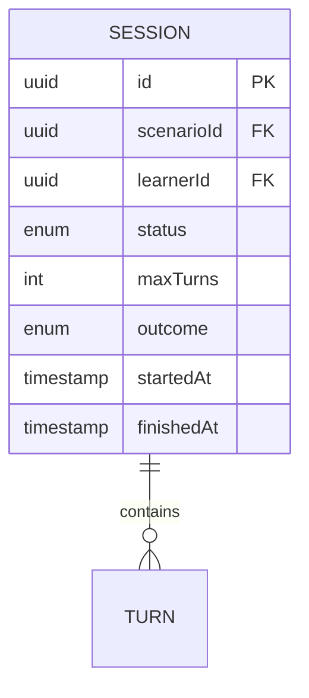
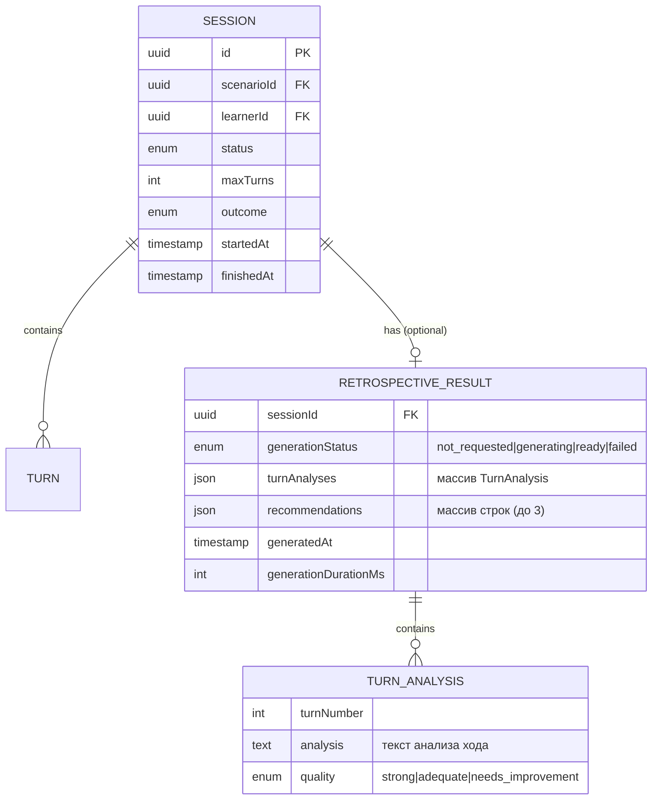
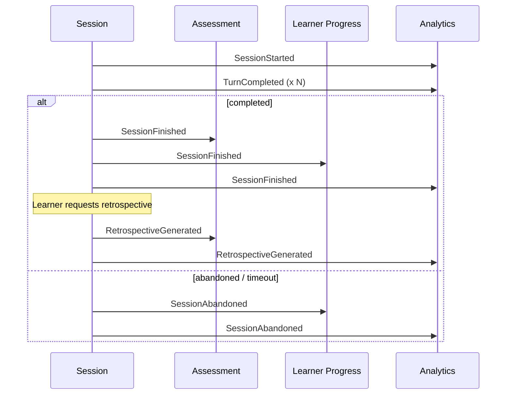

# Domain impact · CHG-0000

## Affected bounded contexts

| Context | Impact level | Source of truth |
|---|---|---|
| training-session | **Major** — новый value object RetrospectiveResult внутри Session aggregate, новое событие | [[docs/domains/training-session/README]] |
| assessment | **Read-only** — может подписаться на RetrospectiveGenerated для обогащения оценки | Assessment domain (будущий) |
| analytics | **Read-only** — новые события для дашбордов | Analytics domain (будущий) |

## Aggregate changes

### Session (training-session)

Расширение существующего агрегата Session новым nullable полем `retrospective`.

**Текущая структура:**

**Новая структура (diff):**

**Ключевые решения:**
- RetrospectiveResult — value object, а не отдельный агрегат, т.к. не имеет самостоятельного жизненного цикла и полностью определяется Session
- Хранится в отдельной таблице (не embedded в Session), но загружается лениво — только при запросе ретроспективы
- generationStatus управляется отдельно от Session.status — не влияет на жизненный цикл сессии

### Новый value object: RetrospectiveResult

| Field | Type | Description |
|---|---|---|
| sessionId | UUID (FK) | Ссылка на сессию |
| generationStatus | Enum | `not_requested`, `generating`, `ready`, `failed` |
| turnAnalyses | TurnAnalysis[] | Анализ каждого хода |
| recommendations | string[] | Персональные рекомендации (до 3) |
| generatedAt | timestamp | Время завершения генерации |
| generationDurationMs | int | Длительность генерации в мс |

### Новый value object: TurnAnalysis

| Field | Type | Description |
|---|---|---|
| turnNumber | int | Номер хода в сессии |
| analysis | text | Текстовый анализ хода |
| quality | Enum | `strong`, `adequate`, `needs_improvement` |

## Domain events

| Event | Producer | Consumers | Payload | Guarantees | Idempotency |
|---|---|---|---|---|---|
| RetrospectiveGenerated | Session | Analytics, Assessment (optional) | `{sessionId, learnerId, turnCount, recommendationCount, generationDurationMs}` | at-least-once | by sessionId |

### Updated event flow

## Invariants check

> [!danger] Проверка всех инвариантов домена training-session
> Каждый инвариант из [[docs/domains/training-session/invariants|invariants.md]] проверен на совместимость с изменением.

- [x] **Session всегда привязана к существующему Scenario ID** · ✅ preserved — ретроспектива не влияет на связь Session-Scenario
- [x] **Session всегда привязана к аутентифицированному Learner ID** · ✅ preserved — ретроспектива не влияет на связь Session-Learner; доступ к ретроспективе проверяет learnerId
- [x] **Количество Turns в сессии <= maxTurns** · ✅ preserved — ретроспектива не добавляет ходы, только анализирует существующие
- [x] **Статус сессии движется только вперёд** · ✅ preserved — generationStatus ретроспективы отделён от Session.status; генерация ретроспективы не меняет статус сессии
- [x] **Каждый Turn имеет уникальный порядковый номер** · ✅ preserved — ретроспектива ссылается на turnNumber read-only, не создаёт новые Turn
- [x] **У одного Learner не более одной сессии в `in_progress`** · ✅ preserved — ретроспектива работает только с `completed` сессиями, не затрагивает активные
- [x] **Завершённая сессия не может быть изменена** · ⚠️ impacted (расширение) — добавление RetrospectiveResult к completed Session формально «изменяет» агрегат. **Решение:** RetrospectiveResult — это append-only enrichment. Session core fields (status, turns, outcome) остаются immutable. Ретроспектива сама по себе immutable после генерации. Это расширение, а не мутация.

## Ubiquitous language update

Предлагаемый новый термин для [[docs/domains/training-session/ubiquitous-language|ubiquitous-language.md]]:

| Term | Definition | Forbidden synonyms | Conflicts with |
|---|---|---|---|
| Retrospective | AI-сгенерированный анализ ходов и рекомендации по итогам завершённой сессии. Immutable после генерации. Value object внутри Session. | Отчёт, оценка, фидбек, review | Assessment domain: Score (оценка в баллах — не то же, что текстовый анализ) |
| Turn Analysis | Текстовый анализ одного хода (Turn) внутри ретроспективы. Включает оценку качества (strong/adequate/needs_improvement). | Разбор, комментарий | — |

## Anti-corruption layer needed?

**Нет.** Изменение целиком внутри домена training-session. RetrospectiveResult — value object внутри Session aggregate. Внешние домены (Assessment, Analytics) только подписываются на событие RetrospectiveGenerated и не имеют прямого доступа к данным ретроспективы.

LLM Service — инфраструктурный сервис, не доменный. Взаимодействие через port/adapter (RetrospectiveGenerator interface), что обеспечивает изоляцию.

## Shared kernel risks

- **Термин "Retrospective"** — не конфликтует с существующими терминами. Assessment использует "Score" для числовой оценки, Retrospective — текстовый анализ.
- **Событие RetrospectiveGenerated** — новое, не пересекается с существующими событиями.
- **Session aggregate** — расширяется, но core контракт (status lifecycle, turns) не меняется. Потребители SessionFinished не затронуты.

## Open questions

Все вопросы перенесены в [[docs/changes/_golden/10-open-questions|Open Questions]].
