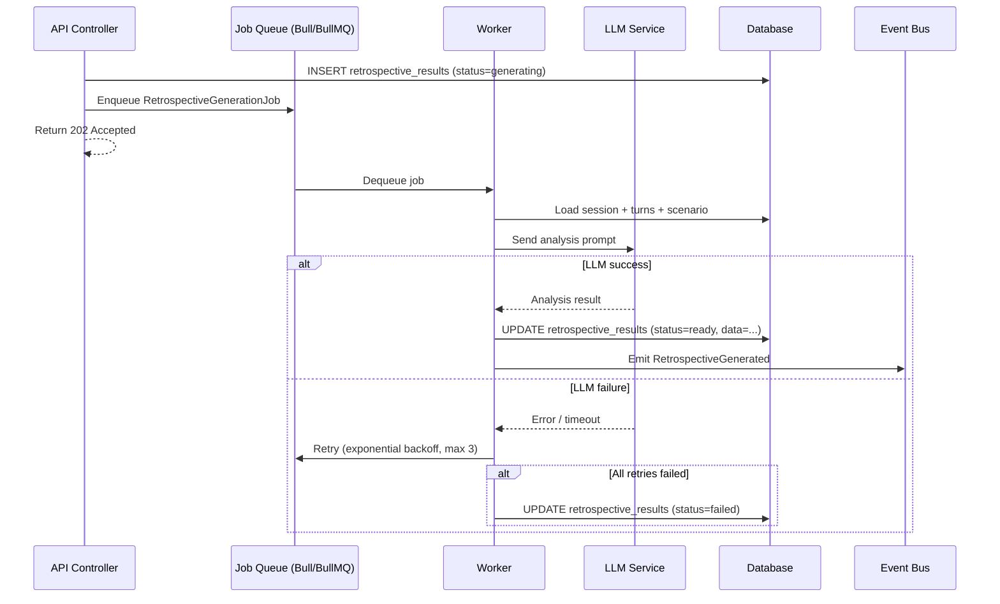

# System analysis · CHG-0000

## API changes

### New endpoints

#### GET `/api/v1/sessions/:sessionId/retrospective`

Получение ретроспективы сессии.

| Parameter | Source | Validation |
|---|---|---|
| sessionId | path | UUID, существующая сессия |
| Authorization | header | Bearer token, learnerId совпадает с session.learnerId |

| Response code | Body | Condition |
|---|---|---|
| 200 OK | `RetrospectiveResult` (full) | Ретроспектива сгенерирована (status = `ready`) |
| 202 Accepted | `{ status: "generating", startedAt }` | Генерация в процессе |
| 404 Not Found | `{ error: "retrospective_not_found" }` | Ретроспектива не запрашивалась или сессия не найдена |
| 403 Forbidden | `{ error: "access_denied" }` | Чужая сессия |
| 409 Conflict | `{ error: "session_not_completed" }` | Сессия не в статусе `completed` |

#### POST `/api/v1/sessions/:sessionId/retrospective/generate`

Запуск генерации ретроспективы.

| Parameter | Source | Validation |
|---|---|---|
| sessionId | path | UUID, существующая сессия |
| Authorization | header | Bearer token, learnerId совпадает с session.learnerId |

| Response code | Body | Condition |
|---|---|---|
| 202 Accepted | `{ jobId, status: "generating" }` | Генерация запущена |
| 200 OK | `RetrospectiveResult` | Ретроспектива уже существует (idempotent) |
| 403 Forbidden | `{ error: "access_denied" }` | Чужая сессия |
| 409 Conflict | `{ error: "session_not_completed" }` | Сессия не в статусе `completed` |
| 422 Unprocessable | `{ error: "no_turns" }` | Сессия без ходов |

### Modified endpoints

Нет. Существующие эндпоинты не изменяются. GET `/api/v1/sessions/:id` может опционально включать `hasRetrospective: boolean` в ответе (feature flag `retrospective.include_in_session_response`).

### Deprecated

Нет.

## DB impact

### New table: `retrospective_results`

```sql
CREATE TABLE retrospective_results (
    session_id       UUID PRIMARY KEY REFERENCES sessions(id),
    generation_status VARCHAR(20) NOT NULL DEFAULT 'generating',
    turn_analyses    JSONB,
    recommendations  JSONB,
    generated_at     TIMESTAMPTZ,
    generation_duration_ms INT,
    created_at       TIMESTAMPTZ NOT NULL DEFAULT NOW(),
    updated_at       TIMESTAMPTZ NOT NULL DEFAULT NOW()
);

CREATE INDEX idx_retrospective_results_status
    ON retrospective_results(generation_status)
    WHERE generation_status = 'generating';
```

- **Tables affected:** 0 существующих (только новая таблица)
- **New indexes:** 1 partial index для мониторинга зависших генераций
- **Migration required:** Да, forward-only миграция (CREATE TABLE). Rollback: DROP TABLE.

### Data volume estimate

| Metric | Value |
|---|---|
| Средний размер RetrospectiveResult | ~5 KB (JSON) |
| Ожидаемых ретроспектив в месяц | ~2000 (60% от completed сессий) |
| Годовой объём | ~120 MB |

## Async flows



### Job configuration

| Parameter | Value |
|---|---|
| Queue name | `retrospective-generation` |
| Max retries | 3 |
| Backoff | Exponential: 5s, 15s, 45s |
| Timeout per attempt | 60 секунд |
| Concurrency | 5 workers |
| Stale job cleanup | Cron: каждые 5 минут, status=`generating` > 5 минут → `failed` |

## Consistency model

- **Eventual consistency:** между запросом генерации и доступностью результата проходит 10-30 секунд
- **Idempotency:** POST /generate — idempotent по sessionId. Повторный вызов не создаёт дублирующую задачу
- **Concurrency control:** Optimistic lock на `retrospective_results.session_id` (PK constraint) предотвращает дублирование записей. Второй concurrent INSERT получает conflict → возвращает текущий статус
- **Read-after-write:** Frontend использует polling (GET каждые 2 секунды) для получения результата. Альтернатива — SSE, решено использовать polling для простоты (см. [[docs/changes/_golden/09-decisions|DEC-002]])

## Failure modes

| Failure | Probability | Impact | Mitigation |
|---|---|---|---|
| LLM API timeout (>60s) | Medium | Генерация не завершается | Auto-retry 3 раза с exponential backoff. После 3 попыток — status `failed`, ручной retry через UI |
| LLM API rate limit | Low | Очередь задач растёт | Concurrency limit = 5 workers. Queue backpressure: при >100 pending jobs — alert |
| LLM возвращает некорректный формат | Low | Парсинг результата падает | Strict JSON schema validation. При ошибке парсинга — retry с уточнённым промптом |
| Concurrent generation requests | Medium | Дублирование записей | PK constraint на session_id. Второй запрос получает текущий статус |
| Database unavailable | Very Low | Потеря результата генерации | Job retry. Результат LLM не теряется — сохраняется в job metadata для re-processing |
| Worker crash mid-generation | Low | Зависшая запись status=`generating` | Stale job cleanup (cron каждые 5 минут). Job timeout = 60s |

## Backward compatibility

- **API:** Полностью backward compatible. Новые эндпоинты, существующие не меняются
- **DB:** Новая таблица, существующие не меняются. Миграция безопасна для rollback (DROP TABLE)
- **Events:** Новое событие RetrospectiveGenerated. Существующие consumers не затронуты — они просто не подписаны на новое событие
- **Frontend:** Feature flag `retrospective.enabled` скрывает весь UI до раскатки

## Observability

### New metrics

| Metric | Type | Labels |
|---|---|---|
| `retrospective.generation.duration_ms` | Histogram | `status` (success/failure) |
| `retrospective.generation.count` | Counter | `status` (success/failure/retry) |
| `retrospective.generation.queue_size` | Gauge | — |
| `retrospective.view.count` | Counter | — |
| `retrospective.llm.tokens_used` | Counter | `model` |

### New logs

| Level | Message | Context |
|---|---|---|
| INFO | `Retrospective generation started` | sessionId, learnerId |
| INFO | `Retrospective generation completed` | sessionId, durationMs, turnCount |
| WARN | `Retrospective generation retry` | sessionId, attempt, error |
| ERROR | `Retrospective generation failed` | sessionId, error, attempts |

### Alerts needed

| Alert | Condition | Severity |
|---|---|---|
| High failure rate | >5% generation failures за 15 минут | Warning |
| Stale generations | >10 jobs в status=`generating` > 5 минут | Warning |
| LLM latency spike | p95 > 45 секунд за 10 минут | Critical |
| Queue backlog | >100 pending jobs | Warning |
