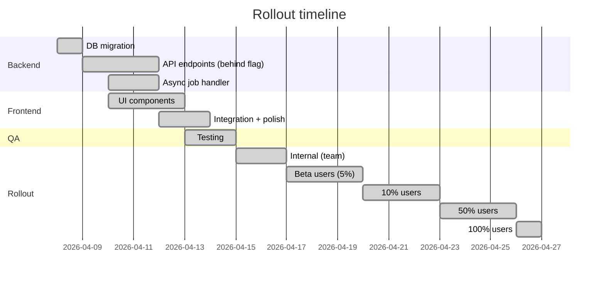

# Rollout · CHG-0000

## Strategy

Feature flag с поэтапной раскаткой: internal → beta → 10% → 50% → 100%.

## Feature flags

| Flag | Default | Condition to enable | Owner |
|---|---|---|---|
| `retrospective.enabled` | `false` | Прошли все QA тесты, internal rollout ok | Анна Петрова |
| `retrospective.generation.enabled` | `true` (когда `retrospective.enabled = true`) | LLM budget approved, prompt quality verified | Иван Сидоров |
| `retrospective.show_quality_badge` | `true` | User research confirms badges are useful | Мария Козлова |

### Rollout stages

| Stage | % users | Duration | Exit criteria |
|---|---|---|---|
| Internal | Team only | 2 дня | Нет critical bugs, промпт даёт адекватные результаты |
| Beta | 5% | 3 дня | Error rate <2%, generation p95 <30s, NPS survey positive |
| Gradual 10% | 10% | 3 дня | Error rate <2%, no performance degradation on Session Results page |
| Gradual 50% | 50% | 3 дня | LLM cost within budget, queue stable, no backlog |
| GA | 100% | — | All metrics green |

## Rollback plan

### Immediate rollback (< 5 минут)

1. Установить feature flag `retrospective.enabled = false`
2. UI ретроспективы скрывается мгновенно
3. API endpoints начинают возвращать 404
4. Pending jobs в очереди завершаются (не прерываются), но результат не показывается

### Full rollback (если нужно удалить данные)

1. Feature flag `retrospective.enabled = false`
2. Остановить worker `retrospective-generation`
3. Очистить очередь: `bull.clean('retrospective-generation')`
4. (Опционально) DROP TABLE `retrospective_results` — только если данные не нужны
5. Откатить frontend deployment до предыдущей версии (если UI-only rollback недостаточен)

> [!warning] Необратимость
> DROP TABLE удаляет все сгенерированные ретроспективы. Пользователи, которые уже видели свои ретроспективы, потеряют доступ. Применять только в крайнем случае.

### Rollback triggers

| Trigger | Action | Owner |
|---|---|---|
| Error rate > 5% за 15 минут | Immediate rollback (flag off) | On-call engineer |
| LLM cost > $X/день | Disable generation flag | Иван Сидоров |
| p95 generation > 60 секунд | Disable generation flag | On-call engineer |
| Negative user feedback > 20% в beta | Pause rollout, review prompts | Анна Петрова |
| Session Results page performance degradation | Immediate rollback | On-call engineer |

## Communication plan

| Audience | Channel | Timing | Message |
|---|---|---|---|
| Internal team | Slack #product | За 1 день до internal rollout | Новая фича: ретроспектива. Пожалуйста, протестируйте |
| Beta users | In-app tooltip | При первом появлении кнопки | «Новое! Посмотрите AI-анализ вашей тренировки» |
| All users | Changelog / release notes | При GA | Стандартные release notes |
| Support team | Internal wiki | За 2 дня до beta | FAQ: что такое ретроспектива, как работает, known limitations |

## Success criteria for rollout

| Criteria | Threshold | Measurement period |
|---|---|---|
| Retrospective open rate | ≥60% completed sessions | 7 дней после GA |
| Generation success rate | ≥98% | Continuous |
| Generation latency p95 | ≤30 секунд | Continuous |
| Error rate (5xx on retrospective endpoints) | <1% | Continuous |
| User satisfaction (in-app survey) | ≥4.0/5.0 | 14 дней после GA |
| No increase in Session Results page load time | Delta <100ms p95 | 7 дней после GA |
| LLM cost per retrospective | ≤$0.05 | 30 дней после GA |
