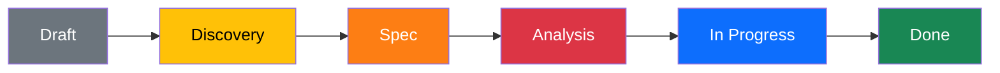

# Change Packages

> [!tip] Живой дашборд
> Таблица ниже автоматически обновляется из frontmatter всех change packages.

## Active changes

```dataview
TABLE id, status, domains, owner
FROM "changes"
WHERE type = "change" AND status != "done"
SORT status ASC
```

## All changes

```dataview
TABLE id, status, domains, created
FROM "changes"
WHERE type = "change"
SORT created DESC
```

## Open questions across all changes

```dataview
TASK FROM "changes"
WHERE !completed AND contains(file.name, "open-questions")
GROUP BY file.folder
```

## Pipeline


