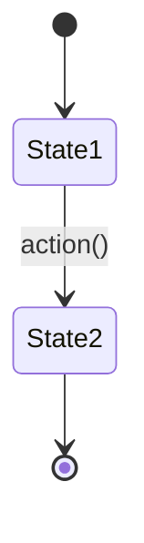
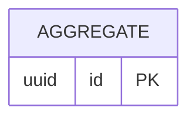

# Aggregates · [Domain name]

## [Aggregate name]

### Responsibility

### State diagram

```mermaid
stateDiagram-v2
    [*] --> State1
    State1 --> State2: action()
    State2 --> [*]
```

### Structure

```mermaid
erDiagram
    AGGREGATE {
        uuid id PK
    }
```

### Boundaries

### Consistency rules

### Cannot be split from
