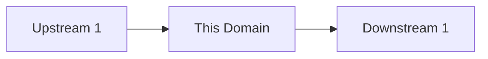

# Integrations · [Domain name]

## Upstream dependencies
<!-- Системы, от которых зависит этот домен -->

## Downstream consumers
<!-- Системы, которые зависят от этого домена -->

## Integration diagram

## Integration contracts
| System | Direction | Protocol | Contract | SLA |
|---|---|---|---|---|
