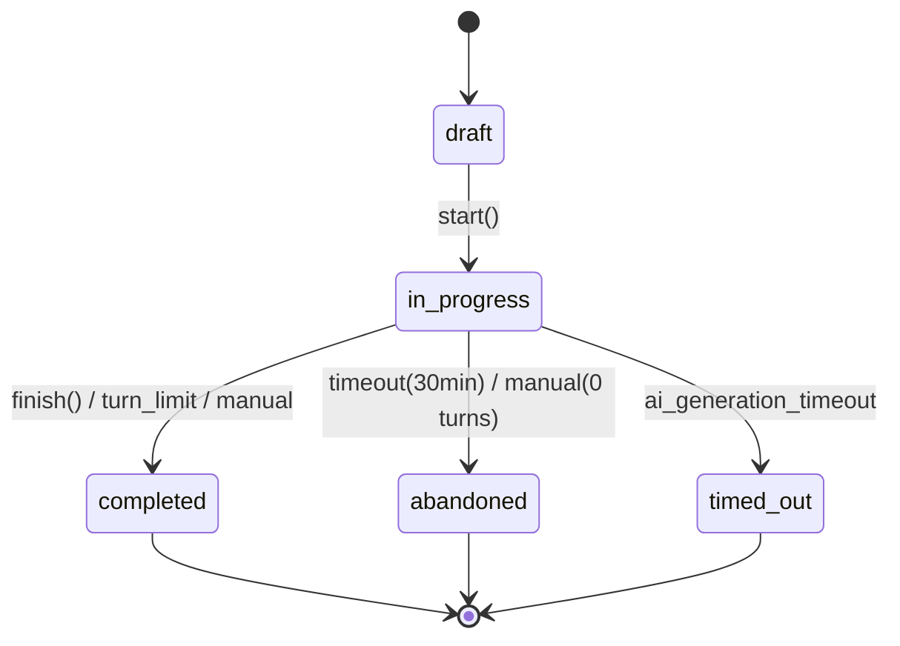
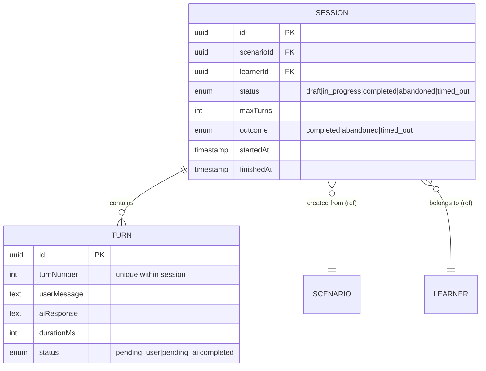

# Aggregates · Training Session

## Session

### Responsibility
Управляет жизненным циклом одной тренировочной сессии: от создания через обмен сообщениями до завершения с фиксацией outcome.

### State diagram

### Boundaries
- Содержит упорядоченный список Turn
- Хранит ссылку на Scenario (по scenarioId) и Learner (по learnerId)
- Хранит текущий статус, метаданные (время старта, лимиты), и outcome
- Не содержит сам шаблон сценария и не хранит оценку

### Structure

### Consistency rules
- Новый Turn можно добавить только в статусе `in_progress`
- Переход статуса только вперёд: `draft → in_progress → completed | abandoned | timed_out`
- Количество Turns не может превышать `maxTurns` (задаётся при создании из сценария)
- При завершении обязательно фиксируется outcome

### Cannot be split from
- **Turn** — ходы существуют только внутри сессии и не имеют смысла вне её контекста
