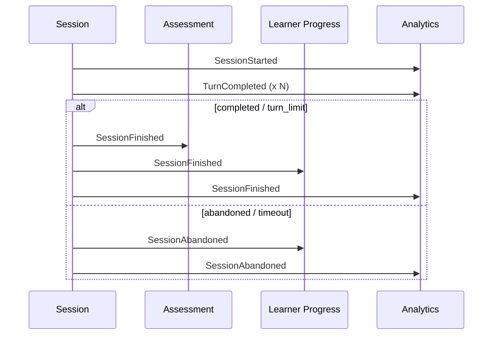

# Domain events · Training Session

| Event | Producer | Consumers | Payload | Guarantees | Idempotency |
|---|---|---|---|---|---|
| SessionStarted | Session | Assessment, Analytics | `{sessionId, learnerId, scenarioId, startedAt}` | at-least-once | by sessionId |
| TurnCompleted | Session | Analytics | `{sessionId, turnNumber, userMessage, aiResponse, durationMs}` | at-least-once | by sessionId + turnNumber |
| SessionFinished | Session | Assessment, Learner Progress, Analytics | `{sessionId, outcome, totalTurns, durationMs, finishedAt}` | at-least-once | by sessionId |
| SessionAbandoned | Session | Analytics, Learner Progress | `{sessionId, learnerId, lastTurnNumber, reason}` | at-least-once | by sessionId |

## Event flow

