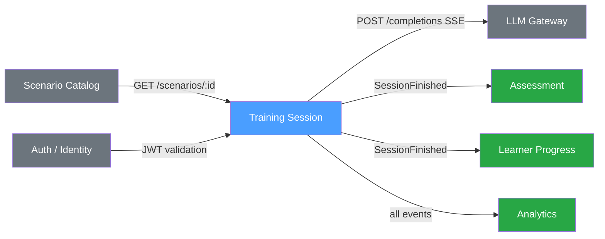

# Integrations · Training Session

## Upstream dependencies
- **Scenario Catalog** — получаем шаблон сценария (system prompt, роль Facilitator, maxTurns, описание)
- **LLM Gateway** — генерация ответов Facilitator (streaming)
- **Auth / Identity** — идентификация и авторизация пользователя (learnerId)

## Downstream consumers
- **Assessment** — оценивает качество ответов после SessionFinished
- **Learner Progress** — обновляет прогресс ученика, streak, статистику
- **Analytics** — трекинг всех доменных событий для дашбордов и метрик

## Integration diagram

## Integration contracts

| System | Direction | Protocol | Contract | SLA |
|---|---|---|---|---|
| Scenario Catalog | upstream | sync REST | `GET /scenarios/{id}` → ScenarioDTO | 200ms p99 |
| LLM Gateway | upstream | async streaming | `POST /completions` → SSE stream | 10s p95 first token |
| Auth / Identity | upstream | sync REST | JWT validation | 50ms p99 |
| Assessment | downstream | async event | `SessionFinished` event | eventual consistency |
| Learner Progress | downstream | async event | `SessionFinished`, `SessionAbandoned` events | eventual consistency |
| Analytics | downstream | async event | all domain events | best-effort delivery |
